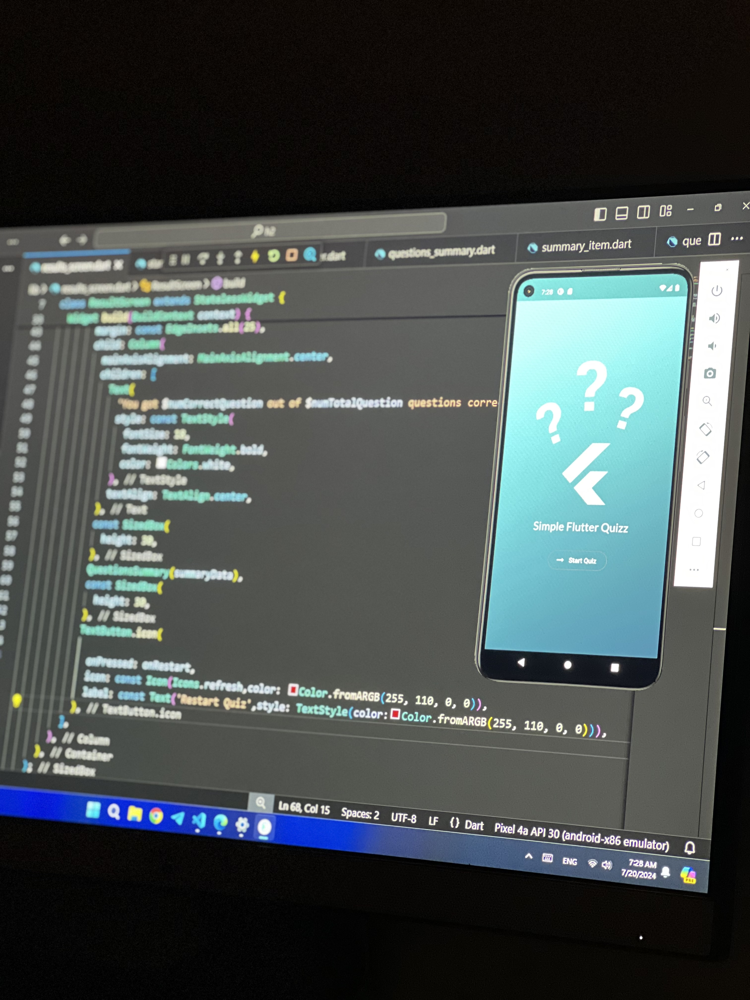
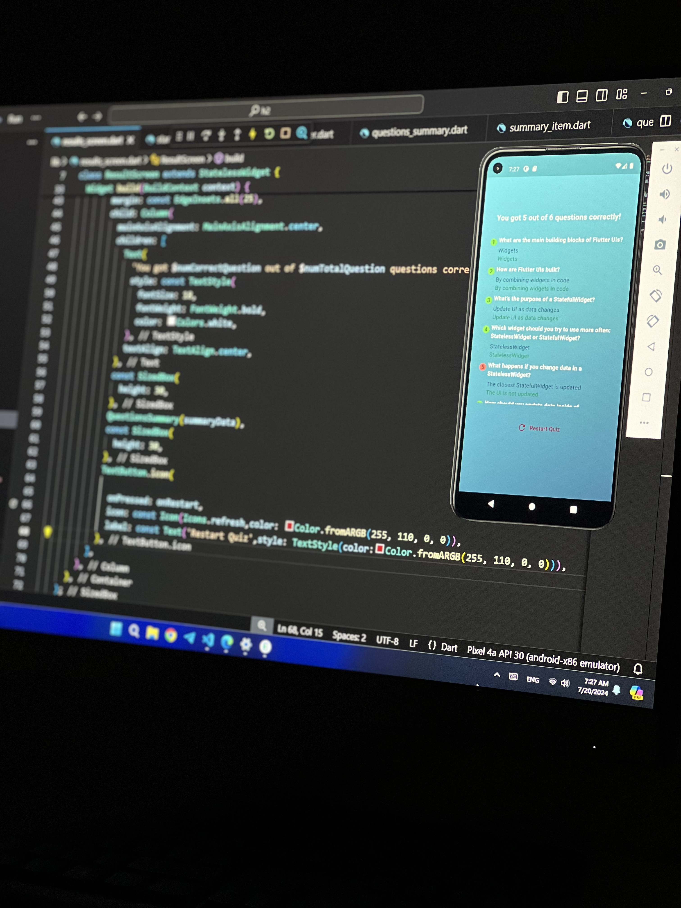

# Simple Quiz App

Welcome to the Simple Quiz App, an engaging application developed using Flutter. This app allows users to participate in a quiz with multiple-choice questions and view their scores instantly.

## Features

- **Start Quiz**: Begin the quiz with a single button press.
- **Multiple-Choice Questions**:  Answer various questions with multiple-choice options.
- **Score Calculation**: See your score at the end of the quiz.

## Installation

To get started with this project, follow these steps:

1. **Clone the Repository:**
   ```bash
   git clone https://github.com/hissahKhalid/Simple-Quiz-App.git
2. **Navigate to the Project Directory:**
    ```bash
    cd quiz-app
3. **Install Dependencies:**
   ```bash
   flutter pub get
4. **Run the Application:**
   ```bash
   flutter run

## Usage
- **Start the Quiz:** Press the start button to begin the quiz.
- **Answer Questions:** Select the correct option for each question.
- **View Score:** Your final score will be displayed at the end of the quiz.

## Screenshots

<div style="display: flex; gap: 10px;">
  
  
</div>

## Contributing
If you want to contribute to this project, feel free to open issues or submit pull requests. Your feedback and contributions are highly appreciated!

## Contact
For any questions or feedback, you can reach out to me at [Hissah.khalid@hotmail.com](mailto:Hissah.khalid@hotmail.com). 

## License
 ```bash
  Copyright 2024 Hissah Khalid.
